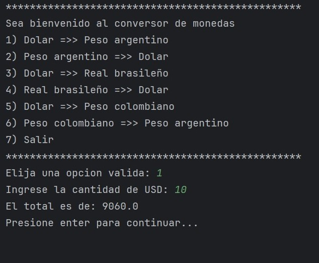

# ConversorDeMonedas
Un conversor simple de monedas escrito en el lenguaje de programación Java para el curso de Oracle Next Education.
El conversor esta conectado a la siguiente api <a>https://www.exchangerate-api.com/</a> la cual nos permite saber el
valor de la moneda que queremos convertir a tiempo real.

<b>IMPORTANTE:</b> Para que el programa funcione correctamente hay que modificar la variable "TOKEN" de la clase
"ConversorDeMonedas/src/com/oracle/conversorMonedas/Request.java"
y colocar tu token personalizada.
